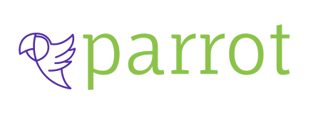

<h1 align="center">
  
</h1>
<h4 align="center">
:construction: Projeto em construção :construction:
</h4>

:memo: Descrição

  
A rede social Parrot é um sistema white label (ou seja, um
sistema modelo que pode ser
reutilizado, apenas modificando informações como
logo e marca) do qual condomínios podem contratar para
incentivar a interação entre os moradores.
A plataforma permite que os usuários façam publicações que
ficam visíveis para toda comunidade.

🛠 Tecnologias

  
As seguintes ferramentas foram usadas na construção do projeto:

- [Bootstrap](https://getbootstrap.com/)
- [Node.js](https://nodejs.org/en/)
- [React](https://pt-br.reactjs.org/)
- [React Redux](https://react-redux.js.org/)
- [TypeScript](https://www.typescriptlang.org/)
  
  

:busts_in_silhouette: Colaboradores

  

  
    
|Front-End|Front-End|Front-End|Back-End|
| :---: | :---: | :---: | :---: |
|[ Luana Souza](https://github.com/lusouzarego)| [ João Roberto](https://github.com/joaogarske)| [ Fábio Volpi](https://github.com/volpifabio)| [ Jonathan Veigel](https://github.com/jonveigel)|
    

 
